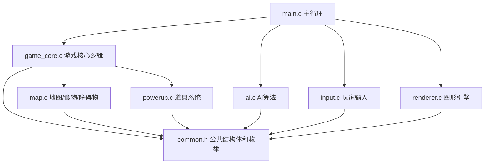

# snake-game
for homework
## setting:
地图大小为50*50
蛇是自动移动 玩家只是控制方向（蛇就定为一秒移动一格）
1.	基础版：
初始蛇三节 
方向随机 
吃一个食物得1分 长度增长1节
因为步数增长（N由随机数生成 可以大一点 增加可玩性） 
地图上有障碍物，每次随机生成 20个
撞墙不会死 会从墙的另一边出来//不行，需要边界
人可以用wasd 和方向建都可以//禁用反向移动
/* 
int opposite(int a, int b) {/*操作反向（坐标差2*2）*/
        return ((a + 2) % 4 == b);
    }
*/
2.	道具版：
在上一版基础上增加道具的随机生成 道具维持地图上有两个
人可以用wasd 和方向建都可以
道具：超大食物（吃一个得10分 长度还是只增长一个）
磁铁（可以直接吸附蛇头周围3*3的食物就是九宫格蛇头在中间 维持时间两个回合 就是吃到两个食物之前都有效）
破壁钻头（可以直接穿过障碍物 但是障碍物还是存在 吃到两个食物之前都有效）
消食片（吃到之后分数不变但是蛇会变短 变为现在蛇长的2/3）//消尾？
减速（吃到之后蛇会减速 两秒移动一格 维持时间还是吃到两个食物之前）//目的？

3.	对战版：
可以选择双人对战还是人机对战 对战版是有道具的（任然是维持地图上两个道具）
双人对战：
一个人用wasd 一个人用方向键 
比拼分数 直至至少有一条蛇死
A蛇的蛇头撞到B蛇的蛇身算作A蛇死 
蛇身相撞不算死 
蛇头相撞一起死

人机对战：
利用我们写的oj版（不过可能要根据规则改一下）
把上面的一个人改为用程序控制
人可以用wasd 和方向建都可以


下面我按**C语言三人协作项目**来设计，图形库可以后续接 EasyX / SDL / raylib。核心思想是：**游戏逻辑不依赖图形库**，这样一个人写逻辑、一个人写图形、一个人写道具和 AI，可以并行开发。

---

# 一、建议项目目录结构

```txt
SnakeBattle/
│
├── include/
│   ├── common.h          // 公共数据结构、枚举、常量
│   ├── game_core.h       // 游戏核心逻辑接口
│   ├── map.h             // 地图、障碍物、食物生成接口
│   ├── powerup.h         // 道具系统接口
│   ├── ai.h              // 人机 AI 接口
│   ├── input.h           // 键盘输入接口
│   └── renderer.h        // 图形绘制接口
│
├── src/
│   ├── main.c            // 主循环
│   ├── game_core.c
│   ├── map.c
│   ├── powerup.c
│   ├── ai.c
│   ├── input.c
│   └── renderer.c
│
└── README.md
```

---

# 二、整体依赖路径图



核心规则：

```txt
common.h 是最底层，所有模块都可以依赖它。

game_core 负责判断游戏输赢、蛇移动、吃食物、死亡检测。

map 只负责地图内容，例如障碍物、食物、随机空格子。

powerup 只负责道具效果，不直接控制图形。

renderer 只负责画，不修改游戏数据。

input 只负责把键盘转成方向。

ai 只负责根据当前 GameState 返回 AI 的下一步方向。
```

---

# 三、公共数据结构：common.h

```c
#ifndef COMMON_H
#define COMMON_H

#include <stdbool.h>

/*
 * 地图大小固定为 50 x 50
 */
#define MAP_WIDTH 50
#define MAP_HEIGHT 50

/*
 * 蛇最大长度不会超过地图总格子数
 */
#define MAX_SNAKE_LENGTH (MAP_WIDTH * MAP_HEIGHT)

/*
 * 基础版随机生成 20 个障碍物
 */
#define OBSTACLE_COUNT 20

/*
 * 道具版 / 对战版中，地图上始终维持 2 个道具
 */
#define POWERUP_ON_MAP 2

/*
 * 初始蛇长度为 3
 */
#define INIT_SNAKE_LENGTH 3

/*
 * 普通移动间隔：1000 ms，即 1 秒移动 1 格
 */
#define NORMAL_MOVE_INTERVAL_MS 1000

/*
 * 减速后移动间隔：2000 ms，即 2 秒移动 1 格
 */
#define SLOW_MOVE_INTERVAL_MS 2000

/*
 * 一个坐标点
 */
typedef struct {
    int x;
    int y;
} Position;

/*
 * 方向枚举
 */
typedef enum {
    DIR_UP,
    DIR_DOWN,
    DIR_LEFT,
    DIR_RIGHT,
    DIR_NONE
} Direction;

/*
 * 游戏模式
 */
typedef enum {
    MODE_BASIC,        // 基础版
    MODE_POWERUP,      // 道具版
    MODE_VERSUS_PVP,   // 双人对战
    MODE_VERSUS_AI     // 人机对战
} GameMode;

/*
 * 地图格子类型
 */
typedef enum {
    CELL_EMPTY,       // 空地
    CELL_OBSTACLE,    // 障碍物
    CELL_FOOD,        // 普通食物
    CELL_POWERUP      // 道具
} CellType;

/*
 * 道具类型
 */
typedef enum {
    POWER_NONE,
    POWER_BIG_FOOD,   // 超大食物：+10 分，长度 +1
    POWER_MAGNET,     // 磁铁：吸附蛇头周围 3x3 食物，持续吃到两个食物
    POWER_DRILL,      // 破壁钻头：可穿过障碍物，持续吃到两个食物
    POWER_DIGEST,     // 消食片：分数不变，蛇长变为 2/3
    POWER_SLOW        // 减速：2 秒移动一格，持续吃到两个食物
} PowerUpType;

/*
 * 游戏状态
 */
typedef enum {
    GAME_RUNNING,      // 游戏进行中
    GAME_OVER,         // 游戏结束
    GAME_PAUSED        // 游戏暂停
} GameStatus;

/*
 * 蛇结构体
 */
typedef struct {
    Position body[MAX_SNAKE_LENGTH];  // body[0] 是蛇头
    int length;                       // 当前长度
    Direction dir;                    // 当前移动方向
    Direction next_dir;               // 玩家下一步输入方向
    int score;                        // 当前分数
    bool alive;                       // 是否存活

    /*
     * 道具效果状态：
     * 这些变量表示某个效果还能持续吃几个食物。
     * 例如 magnet_food_left = 2，表示再吃两个食物后磁铁失效。
     */
    int magnet_food_left;
    int drill_food_left;
    int slow_food_left;

    /*
     * 当前移动间隔。
     * 默认 1000 ms，减速后 2000 ms。
     */
    int move_interval_ms;

} Snake;

/*
 * 地图结构体
 */
typedef struct {
    CellType cells[MAP_HEIGHT][MAP_WIDTH];

    /*
     * 普通食物坐标。
     * 简化设计：基础版和道具版都只保留一个普通食物。
     */
    Position food_pos;
} Map;

/*
 * 地图上的一个道具
 */
typedef struct {
    PowerUpType type;
    Position pos;
    bool active;       // 是否存在于地图上
} PowerUp;

/*
 * 整个游戏状态
 */
typedef struct {
    GameMode mode;             // 当前模式
    GameStatus status;         // 游戏状态

    Map map;                   // 地图
    Snake snake1;              // 玩家 1
    Snake snake2;              // 玩家 2 或 AI

    PowerUp powerups[POWERUP_ON_MAP];  // 地图上的道具

    int step_count;            // 当前已经移动了多少步
    int random_event_step;     // 随机 N 步触发事件，可用于增加难度

    bool has_snake2;           // 是否启用第二条蛇
    bool snake2_is_ai;         // 第二条蛇是否由 AI 控制
} GameState;

#endif
```

---

# 四、游戏核心逻辑接口：game_core.h

这一层是项目最重要的部分，负责**游戏规则本身**。

```c
#ifndef GAME_CORE_H
#define GAME_CORE_H

#include "common.h"

/*
 * 初始化整个游戏。
 *
 * 参数：
 * - state：游戏状态指针
 * - mode：游戏模式
 *
 * 功能：
 * - 清空地图
 * - 初始化蛇
 * - 生成障碍物
 * - 生成食物
 * - 如果是道具版或对战版，生成道具
 */
void Game_Init(GameState *state, GameMode mode);

/*
 * 初始化一条蛇。
 *
 * 参数：
 * - snake：要初始化的蛇
 * - start_pos：蛇头初始位置
 * - dir：初始方向
 *
 * 功能：
 * - 设置蛇长度为 3
 * - 根据方向摆放蛇身
 * - 设置分数为 0
 * - 设置道具效果为空
 */
void Snake_Init(Snake *snake, Position start_pos, Direction dir);

/*
 * 游戏每一帧更新。
 *
 * 参数：
 * - state：游戏状态
 * - delta_ms：距离上一帧经过的毫秒数
 *
 * 功能：
 * - 判断是否到达蛇移动时间
 * - 更新蛇的位置
 * - 判断吃食物、吃道具、撞墙、撞障碍、撞蛇身
 * - 判断游戏是否结束
 */
void Game_Update(GameState *state, int delta_ms);

/*
 * 让指定蛇移动一格。
 *
 * 参数：
 * - state：游戏状态
 * - snake：要移动的蛇
 *
 * 功能：
 * - 根据 snake->next_dir 更新方向
 * - 计算新的蛇头位置
 * - 处理增长或移动
 */
void Snake_Move(GameState *state, Snake *snake);

/*
 * 设置蛇的下一步方向。
 *
 * 参数：
 * - snake：目标蛇
 * - dir：新的方向
 *
 * 功能：
 * - 禁止反向移动
 * - 如果合法，则更新 snake->next_dir
 */
void Snake_SetDirection(Snake *snake, Direction dir);

/*
 * 判断两个方向是否相反。
 *
 * 返回：
 * - true：方向相反
 * - false：方向不相反
 */
bool Direction_IsOpposite(Direction a, Direction b);

/*
 * 根据当前位置和方向，计算下一格坐标。
 *
 * 参数：
 * - pos：当前位置
 * - dir：方向
 *
 * 返回：
 * - 下一格坐标
 */
Position Position_Next(Position pos, Direction dir);

/*
 * 判断蛇头是否撞墙。
 *
 * 注意：
 * 你们的最终设定是“需要边界”，所以撞墙会死。
 */
bool Game_CheckWallCollision(Position pos);

/*
 * 判断蛇头是否撞到障碍物。
 *
 * 如果蛇当前拥有破壁钻头效果，则撞障碍不死。
 */
bool Game_CheckObstacleCollision(GameState *state, Snake *snake, Position head_pos);

/*
 * 判断蛇头是否撞到自己的身体。
 */
bool Snake_CheckSelfCollision(Snake *snake, Position head_pos);

/*
 * 判断一条蛇的蛇头是否撞到另一条蛇的身体。
 *
 * 对战规则：
 * - A 蛇头撞 B 蛇身，A 死
 * - 蛇身相撞不算死
 */
bool Snake_CheckOtherBodyCollision(Snake *attacker, Snake *target);

/*
 * 判断双蛇蛇头是否相撞。
 *
 * 对战规则：
 * - 蛇头相撞，两条蛇一起死
 */
bool Snake_CheckHeadCollision(Snake *a, Snake *b);

/*
 * 处理蛇吃普通食物。
 *
 * 功能：
 * - 分数 +1
 * - 长度 +1
 * - 刷新食物
 * - 道具持续回合减少
 */
void Game_HandleEatFood(GameState *state, Snake *snake);

/*
 * 处理游戏结束。
 *
 * 功能：
 * - 根据蛇的 alive 状态设置 GAME_OVER
 * - 对战模式可以比较分数
 */
void Game_CheckGameOver(GameState *state);

/*
 * 获得当前胜利者。
 *
 * 返回：
 * - 0：平局或未结束
 * - 1：蛇 1 获胜
 * - 2：蛇 2 获胜
 */
int Game_GetWinner(GameState *state);

#endif
```

---

# 五、地图系统接口：map.h

地图系统只负责**哪里能放东西**，不负责游戏规则。

```c
#ifndef MAP_H
#define MAP_H

#include "common.h"

/*
 * 初始化地图。
 *
 * 功能：
 * - 所有格子设为空地
 */
void Map_Init(Map *map);

/*
 * 随机生成障碍物。
 *
 * 参数：
 * - state：游戏状态
 * - count：障碍物数量
 *
 * 功能：
 * - 随机选择空格子
 * - 生成指定数量障碍物
 * - 不允许生成在蛇身、食物、道具上
 */
void Map_GenerateObstacles(GameState *state, int count);

/*
 * 生成一个普通食物。
 *
 * 功能：
 * - 在空格子生成普通食物
 * - 更新 state->map.food_pos
 */
void Map_GenerateFood(GameState *state);

/*
 * 判断一个坐标是否在地图内。
 *
 * 返回：
 * - true：在地图内
 * - false：越界
 */
bool Map_IsInside(Position pos);

/*
 * 判断某个格子是否为空。
 *
 * 注意：
 * 这里需要同时考虑：
 * - 地图 cell 是否为空
 * - 是否被蛇身体占据
 * - 是否被道具占据
 */
bool Map_IsCellEmpty(GameState *state, Position pos);

/*
 * 随机获取一个空格子。
 *
 * 返回：
 * - 一个可用坐标
 */
Position Map_GetRandomEmptyCell(GameState *state);

/*
 * 设置某个格子的类型。
 */
void Map_SetCell(Map *map, Position pos, CellType type);

/*
 * 获取某个格子的类型。
 */
CellType Map_GetCell(Map *map, Position pos);

/*
 * 判断某个位置是否被任意蛇占据。
 */
bool Map_IsOccupiedBySnake(GameState *state, Position pos);

/*
 * 判断某个位置是否被某条蛇占据。
 */
bool Snake_ContainsPosition(Snake *snake, Position pos);

#endif
```

---

# 六、道具系统接口：powerup.h

道具系统负责**生成道具、检测吃道具、应用效果、更新持续时间**。

```c
#ifndef POWERUP_H
#define POWERUP_H

#include "common.h"

/*
 * 初始化道具系统。
 *
 * 功能：
 * - 清空所有道具
 * - 如果当前模式支持道具，则生成两个道具
 */
void PowerUp_Init(GameState *state);

/*
 * 保证地图上始终有两个道具。
 *
 * 功能：
 * - 如果某个道具被吃掉，就随机生成新的道具
 */
void PowerUp_Maintain(GameState *state);

/*
 * 随机生成一个道具。
 *
 * 参数：
 * - state：游戏状态
 * - index：道具数组下标
 *
 * 功能：
 * - 随机选择道具类型
 * - 随机选择空格子
 * - 放入地图
 */
void PowerUp_Spawn(GameState *state, int index);

/*
 * 随机获得一个道具类型。
 *
 * 返回：
 * - POWER_BIG_FOOD / POWER_MAGNET / POWER_DRILL / POWER_DIGEST / POWER_SLOW
 */
PowerUpType PowerUp_GetRandomType(void);

/*
 * 判断蛇头是否吃到道具。
 *
 * 参数：
 * - state：游戏状态
 * - snake：当前蛇
 *
 * 返回：
 * - true：吃到道具
 * - false：没有吃到
 */
bool PowerUp_CheckEat(GameState *state, Snake *snake);

/*
 * 对蛇应用道具效果。
 *
 * 参数：
 * - state：游戏状态
 * - snake：吃到道具的蛇
 * - type：道具类型
 *
 * 功能：
 * - 根据道具类型修改蛇的状态
 */
void PowerUp_Apply(GameState *state, Snake *snake, PowerUpType type);

/*
 * 应用超大食物效果。
 *
 * 效果：
 * - 分数 +10
 * - 长度 +1
 */
void PowerUp_ApplyBigFood(GameState *state, Snake *snake);

/*
 * 应用磁铁效果。
 *
 * 效果：
 * - snake->magnet_food_left = 2
 * - 后续吃到两个食物后失效
 */
void PowerUp_ApplyMagnet(Snake *snake);

/*
 * 应用破壁钻头效果。
 *
 * 效果：
 * - snake->drill_food_left = 2
 * - 后续吃到两个食物后失效
 */
void PowerUp_ApplyDrill(Snake *snake);

/*
 * 应用消食片效果。
 *
 * 效果：
 * - 分数不变
 * - 蛇长变成当前长度的 2/3
 * - 最短保留 3 节，避免吃完直接消失
 */
void PowerUp_ApplyDigest(Snake *snake);

/*
 * 应用减速效果。
 *
 * 效果：
 * - snake->slow_food_left = 2
 * - snake->move_interval_ms = 2000
 */
void PowerUp_ApplySlow(Snake *snake);

/*
 * 每当蛇吃到一个食物后，更新持续型道具效果。
 *
 * 功能：
 * - 磁铁剩余次数 -1
 * - 钻头剩余次数 -1
 * - 减速剩余次数 -1
 * - 如果减速次数归零，恢复正常速度
 */
void PowerUp_UpdateEffectAfterEating(Snake *snake);

/*
 * 处理磁铁效果。
 *
 * 效果：
 * - 检查蛇头周围 3x3 范围
 * - 如果普通食物在范围内，则自动吃掉
 */
void PowerUp_HandleMagnet(GameState *state, Snake *snake);

/*
 * 判断一个位置是否在蛇头九宫格范围内。
 */
bool PowerUp_IsInMagnetRange(Position head, Position food);

#endif
```

---

# 七、AI 算法接口：ai.h

AI 不直接移动蛇，只负责返回一个方向。

```c
#ifndef AI_H
#define AI_H

#include "common.h"

/*
 * AI 主决策函数。
 *
 * 参数：
 * - state：当前游戏状态
 * - ai_snake：AI 控制的蛇
 * - enemy_snake：玩家蛇
 *
 * 返回：
 * - AI 下一步想走的方向
 *
 * 基础策略：
 * 1. 优先朝食物方向移动
 * 2. 避免撞墙
 * 3. 避免撞障碍物
 * 4. 避免撞自己
 * 5. 避免撞玩家蛇身
 */
Direction AI_GetNextDirection(GameState *state, Snake *ai_snake, Snake *enemy_snake);

/*
 * 判断某个方向是否安全。
 *
 * 返回：
 * - true：安全
 * - false：会撞墙、撞障碍、撞蛇身
 */
bool AI_IsDirectionSafe(GameState *state, Snake *ai_snake, Snake *enemy_snake, Direction dir);

/*
 * 计算从当前位置到目标位置的曼哈顿距离。
 *
 * 用途：
 * - 判断哪个方向更接近食物
 */
int AI_ManhattanDistance(Position a, Position b);

/*
 * 获取所有安全方向。
 *
 * 参数：
 * - safe_dirs：输出数组，最多 4 个方向
 *
 * 返回：
 * - 安全方向数量
 */
int AI_GetSafeDirections(
    GameState *state,
    Snake *ai_snake,
    Snake *enemy_snake,
    Direction safe_dirs[4]
);

/*
 * 从安全方向中选择最接近食物的方向。
 *
 * 返回：
 * - 最佳方向
 */
Direction AI_ChooseDirectionToFood(
    GameState *state,
    Snake *ai_snake,
    Direction safe_dirs[4],
    int safe_count
);

/*
 * 如果没有明显更优方向，则随机选择一个安全方向。
 */
Direction AI_ChooseRandomSafeDirection(Direction safe_dirs[4], int safe_count);

#endif
```

---

# 八、输入系统接口：input.h

输入系统只把键盘转换成方向，不做游戏规则判断。

```c
#ifndef INPUT_H
#define INPUT_H

#include "common.h"

/*
 * 初始化输入系统。
 *
 * 如果使用 EasyX / SDL / raylib，可以在这里做对应初始化。
 */
void Input_Init(void);

/*
 * 读取玩家 1 的输入。
 *
 * 玩家 1 支持：
 * - W A S D
 * - 方向键
 *
 * 返回：
 * - 输入方向
 * - 如果没有输入，返回 DIR_NONE
 */
Direction Input_GetPlayer1Direction(void);

/*
 * 读取玩家 2 的输入。
 *
 * 玩家 2 使用方向键。
 *
 * 注意：
 * 双人对战时建议：
 * - 玩家 1：WASD
 * - 玩家 2：方向键
 */
Direction Input_GetPlayer2Direction(void);

/*
 * 判断玩家是否按下暂停键。
 */
bool Input_IsPausePressed(void);

/*
 * 判断玩家是否按下退出键。
 */
bool Input_IsQuitPressed(void);

#endif
```

---

# 九、图形引擎接口：renderer.h

图形模块只画画，不改变游戏状态。

```c
#ifndef RENDERER_H
#define RENDERER_H

#include "common.h"

/*
 * 初始化图形窗口。
 *
 * 参数：
 * - width：窗口宽度
 * - height：窗口高度
 *
 * 功能：
 * - 创建窗口
 * - 设置背景
 * - 初始化字体等
 */
void Renderer_Init(int width, int height);

/*
 * 清空屏幕。
 */
void Renderer_Clear(void);

/*
 * 绘制整个游戏画面。
 *
 * 功能：
 * - 绘制地图
 * - 绘制障碍物
 * - 绘制食物
 * - 绘制道具
 * - 绘制蛇
 * - 绘制分数
 */
void Renderer_DrawGame(GameState *state);

/*
 * 绘制地图网格。
 */
void Renderer_DrawGrid(void);

/*
 * 绘制障碍物。
 */
void Renderer_DrawObstacles(Map *map);

/*
 * 绘制普通食物。
 */
void Renderer_DrawFood(Map *map);

/*
 * 绘制一条蛇。
 *
 * 参数：
 * - snake：蛇
 * - player_id：玩家编号，用于区分颜色
 */
void Renderer_DrawSnake(Snake *snake, int player_id);

/*
 * 绘制道具。
 */
void Renderer_DrawPowerUps(GameState *state);

/*
 * 绘制 UI。
 *
 * 功能：
 * - 显示玩家分数
 * - 显示当前模式
 * - 显示道具状态
 */
void Renderer_DrawUI(GameState *state);

/*
 * 绘制游戏结束界面。
 */
void Renderer_DrawGameOver(GameState *state);

/*
 * 刷新屏幕。
 *
 * 双缓冲绘图时，在这里统一提交画面。
 */
void Renderer_Present(void);

/*
 * 关闭图形系统。
 */
void Renderer_Destroy(void);

#endif
```

---

# 十、主循环 main.c 的逻辑骨架

```c
#include "common.h"
#include "game_core.h"
#include "renderer.h"
#include "input.h"
#include "ai.h"

/*
 * 主函数。
 *
 * 这里只负责组织流程，不写复杂规则。
 */
int main(void)
{
    GameState game;

    /*
     * 这里可以先默认进入基础版。
     * 后续可以做菜单，让玩家选择：
     * MODE_BASIC / MODE_POWERUP / MODE_VERSUS_PVP / MODE_VERSUS_AI
     */
    GameMode mode = MODE_BASIC;

    /*
     * 初始化游戏数据
     */
    Game_Init(&game, mode);

    /*
     * 初始化图形窗口
     */
    Renderer_Init(800, 800);

    /*
     * 初始化输入系统
     */
    Input_Init();

    /*
     * 游戏主循环
     */
    while (game.status != GAME_OVER)
    {
        /*
         * 读取玩家 1 输入
         */
        Direction p1_dir = Input_GetPlayer1Direction();

        if (p1_dir != DIR_NONE)
        {
            Snake_SetDirection(&game.snake1, p1_dir);
        }

        /*
         * 如果是双人对战，读取玩家 2 输入
         */
        if (game.mode == MODE_VERSUS_PVP)
        {
            Direction p2_dir = Input_GetPlayer2Direction();

            if (p2_dir != DIR_NONE)
            {
                Snake_SetDirection(&game.snake2, p2_dir);
            }
        }

        /*
         * 如果是人机对战，由 AI 决定蛇 2 的方向
         */
        if (game.mode == MODE_VERSUS_AI)
        {
            Direction ai_dir = AI_GetNextDirection(
                &game,
                &game.snake2,
                &game.snake1
            );

            Snake_SetDirection(&game.snake2, ai_dir);
        }

        /*
         * 更新游戏逻辑。
         * 这里的 delta_ms 后续可以用真实计时器计算。
         */
        Game_Update(&game, 16);

        /*
         * 绘制游戏画面
         */
        Renderer_Clear();
        Renderer_DrawGame(&game);
        Renderer_Present();
    }

    /*
     * 游戏结束界面
     */
    Renderer_DrawGameOver(&game);

    /*
     * 关闭图形系统
     */
    Renderer_Destroy();

    return 0;
}
```

---

# 十一、三人开发分工建议

## 同学 A：游戏核心逻辑

负责文件：

```txt
common.h
game_core.h
game_core.c
map.h
map.c
```

主要任务：

```txt
1. 初始化蛇
2. 初始化地图
3. 随机生成障碍物
4. 随机生成食物
5. 蛇自动移动
6. 禁止反向移动
7. 判断撞墙
8. 判断撞障碍物
9. 判断撞自己
10. 判断对战碰撞
11. 判断游戏结束
```

---

## 同学 B：图形引擎和输入

负责文件：

```txt
renderer.h
renderer.c
input.h
input.c
main.c
```

主要任务：

```txt
1. 创建窗口
2. 绘制 50 x 50 地图
3. 绘制蛇
4. 绘制食物
5. 绘制障碍物
6. 绘制道具
7. 显示分数
8. 显示游戏结束界面
9. 读取 WASD 和方向键
10. 写主循环
```

---

## 同学 C：道具系统和 AI

负责文件：

```txt
powerup.h
powerup.c
ai.h
ai.c
```

主要任务：

```txt
1. 生成两个道具
2. 吃掉道具后刷新
3. 实现超大食物
4. 实现磁铁
5. 实现破壁钻头
6. 实现消食片
7. 实现减速
8. 实现 AI 自动寻路
9. AI 避免撞墙、撞障碍、撞蛇身
```

---

# 十二、规则细节建议统一

你们计划书里有几个地方建议明确，否则后面写代码容易冲突。

## 1. 撞墙规则

建议最终采用：

```txt
撞墙死亡。
```

因为你们已经备注了“需要边界”。

---

## 2. 禁止反向移动

例如蛇正在向右走：

```txt
允许：上、下、右
禁止：左
```

这个由 `Snake_SetDirection()` 实现。

---

## 3. 消食片

建议定义为：

```txt
吃到后，分数不变，蛇的长度变为当前长度的 2/3。
但蛇最短不能短于 3 节。
```

也就是从尾巴开始删除。

---

## 4. 磁铁

建议定义为：

```txt
蛇头周围 3 x 3 范围内如果有普通食物，则立即吸收。
吸收后：
- 分数 +1
- 长度 +1
- 刷新普通食物
- 磁铁剩余食物次数 -1
```

---

## 5. 破壁钻头

建议定义为：

```txt
可以穿过障碍物。
障碍物不消失。
效果持续到蛇再吃两个食物。
```

---

## 6. 减速

建议定义为：

```txt
蛇从 1 秒移动一格变成 2 秒移动一格。
效果持续到蛇再吃两个食物。
```

在对战版中，这个道具对吃到它的蛇生效。如果觉得减速是负面道具，也可以设计成“陷阱道具”，但目前按正面道具处理。

---

## 7. 对战死亡规则

建议严格写成：

```txt
A 蛇头撞 B 蛇身：A 死。

B 蛇头撞 A 蛇身：B 死。

蛇头撞蛇头：两条蛇都死。

蛇身相撞：不判定死亡。

撞墙：死亡。

撞障碍物：没有钻头则死亡，有钻头则不死。

撞自己身体：死亡。
```

---

# 十三、推荐开发顺序

```txt
第一阶段：基础版
1. 地图 50 x 50
2. 一条蛇
3. 自动移动
4. WASD / 方向键控制
5. 禁止反向移动
6. 普通食物
7. 障碍物
8. 撞墙死亡
9. 撞自己死亡
10. 分数系统

第二阶段：道具版
1. 地图维持两个道具
2. 超大食物
3. 磁铁
4. 破壁钻头
5. 消食片
6. 减速

第三阶段：双人对战
1. 两条蛇
2. 两套输入
3. 分数分别统计
4. 蛇头撞蛇身死亡
5. 蛇头相撞一起死
6. 游戏结束判定

第四阶段：人机对战
1. AI 朝食物移动
2. AI 避免撞墙
3. AI 避免撞障碍
4. AI 避免撞自己
5. AI 避免撞玩家蛇身
```

---

# 十四、最重要的接口关系总结

你们三个人只要统一下面几个结构，就可以并行开发：

```c
GameState
Snake
Map
PowerUp
Direction
Position
```

主循环只需要不断做四件事：

```txt
1. 读取输入 / AI 决策
2. 设置蛇的方向
3. 更新游戏逻辑
4. 绘制游戏画面
```

对应代码就是：

```c
Snake_SetDirection(&game.snake1, input_dir);
Game_Update(&game, delta_ms);
Renderer_DrawGame(&game);
```

这样项目结构会比较清晰，也方便后面写 Git 协作：每个人负责自己的 `.h` 和 `.c` 文件，合并时只要接口不乱改，就不容易冲突。
